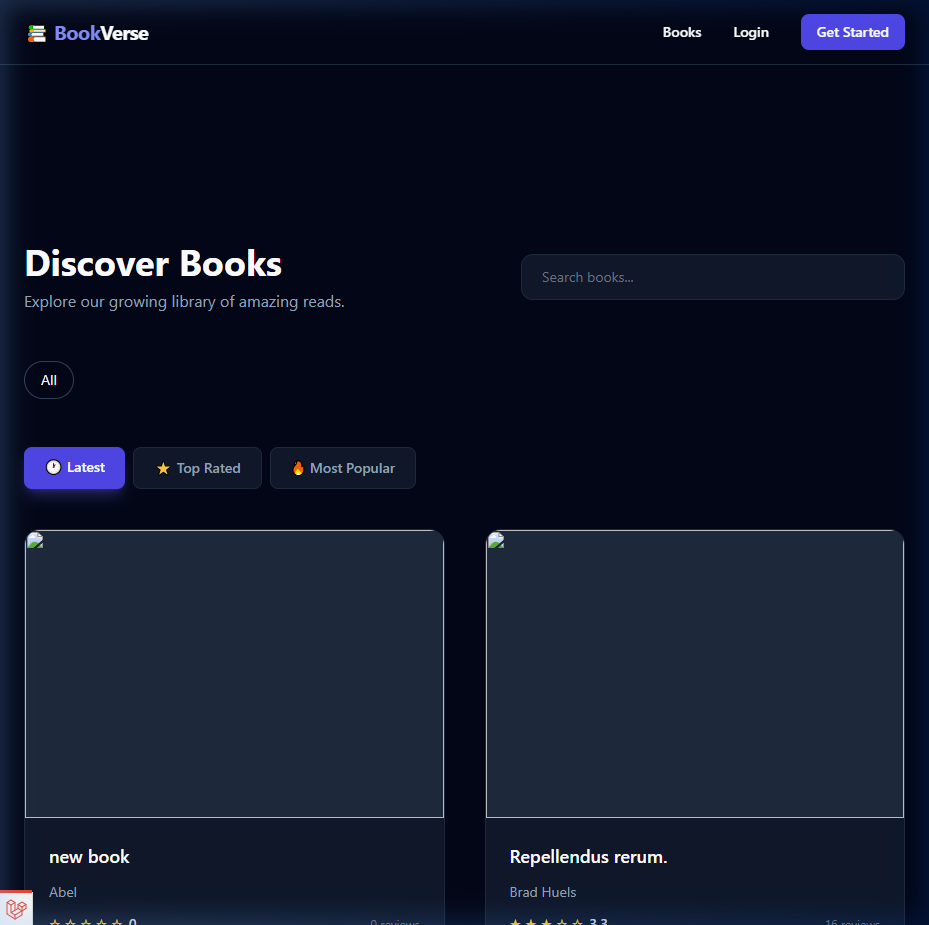
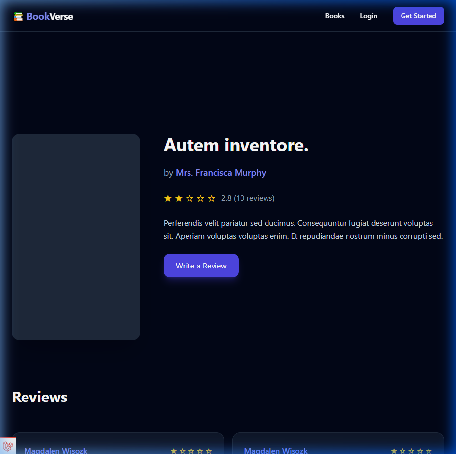
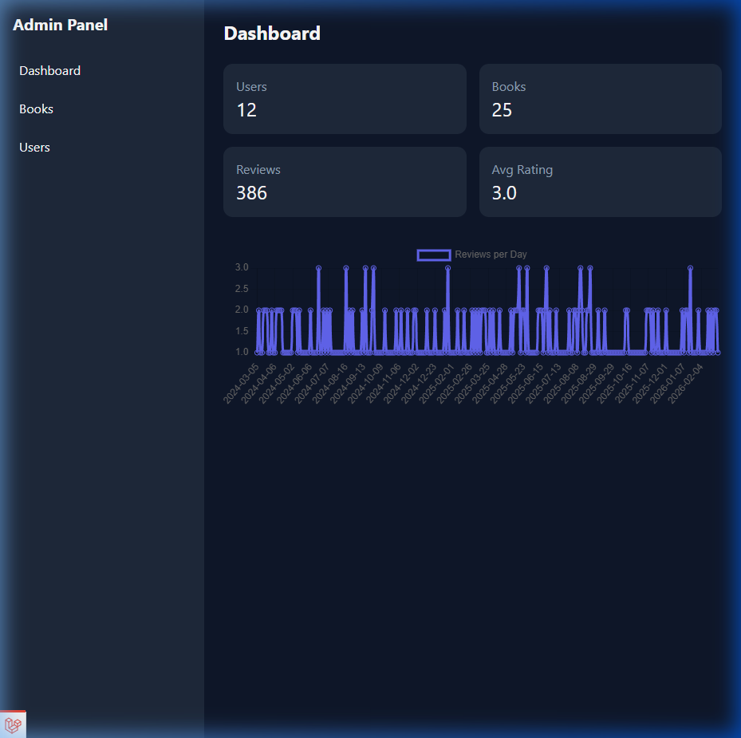
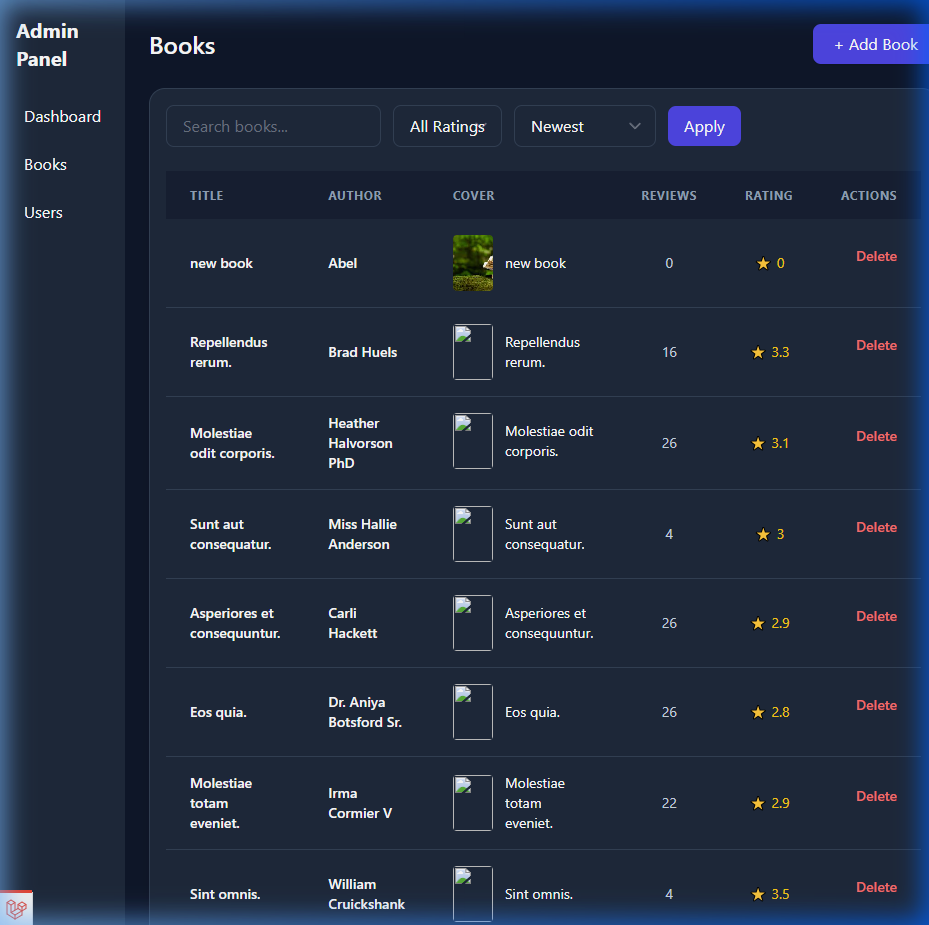
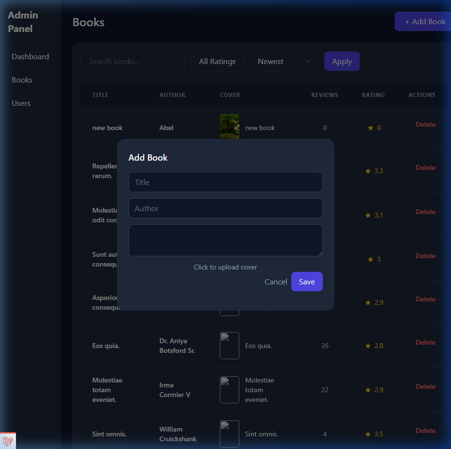

# BookVerse - Premium Book Review Platform

BookVerse is a modern, full-featured web application built with Laravel, designed for book enthusiasts to discover, review, and manage their favorite reads. It features a sleek dark-themed UI, real-time analytics, and a robust administration panel.

---

## 🌟 Key Features

- **Public Book Catalog**: Browse through a curated collection of books with advanced filtering and search.
- **Detailed Reviews**: Share your thoughts and rate books with a dynamic review system.
- **Admin Dashboard**: Real-time insights into user activity, book counts, and review trends using Chart.js.
- **Book Management**: Full CRUD operations for books, including cover image uploads and metadata management.
- **User Management**: Administrative control over user accounts.
- **Modern UI/UX**: Built with Tailwind CSS, featuring responsive grids, glassmorphism, and smooth micro-animations.

---

## 📸 Screenshots

### 🏠 Homepage
The gateway to BookVerse, featuring a stunning hero section and clear calls to action.


### 📚 Books Catalog
A comprehensive list of all available books with filtering options.


### 📖 Book Details
Deep dive into book descriptions and community reviews.


### 📊 Admin Dashboard
Interactive charts and key statistics for site administrators.


### 🛠️ Admin Book Management
A powerful interface for managing the book library, including the "Add Book" modal.



### 👤 Admin User Management
Monitor and manage the community members.


---

## 🚀 Getting Started

### Prerequisites
- PHP 8.2+
- Composer
- Node.js & NPM
- SQLite (or your preferred database)

### Installation

1. **Clone the repository**
   ```bash
   git clone <repository-url>
   cd book-review
   ```

2. **Install dependencies**
   ```bash
   composer install
   npm install
   ```

3. **Environment Setup**
   ```bash
   cp .env.example .env
   php artisan key:generate
   ```

4. **Database Configuration**
   Initialize your database and run migrations:
   ```bash
   touch database/database.sqlite
   php artisan migrate --seed
   ```

5. **Storage Link**
   Ensure the storage link is created for image uploads:
   ```bash
   php artisan storage:link
   ```

6. **Run the Application**
   ```bash
   npm run dev
   # In a separate terminal
   php artisan serve
   ```

---

## 🛠️ Built With

- **Laravel** - The PHP Framework for Web Artisans
- **Tailwind CSS** - For modern styling
- **Chart.js** - For beautiful data visualizations
- **Vite** - Frontend build tool
- **Alpine.js** - Light-weight JavaScript for interactions

---

Developed with ❤️ as part of the BookVerse project.
